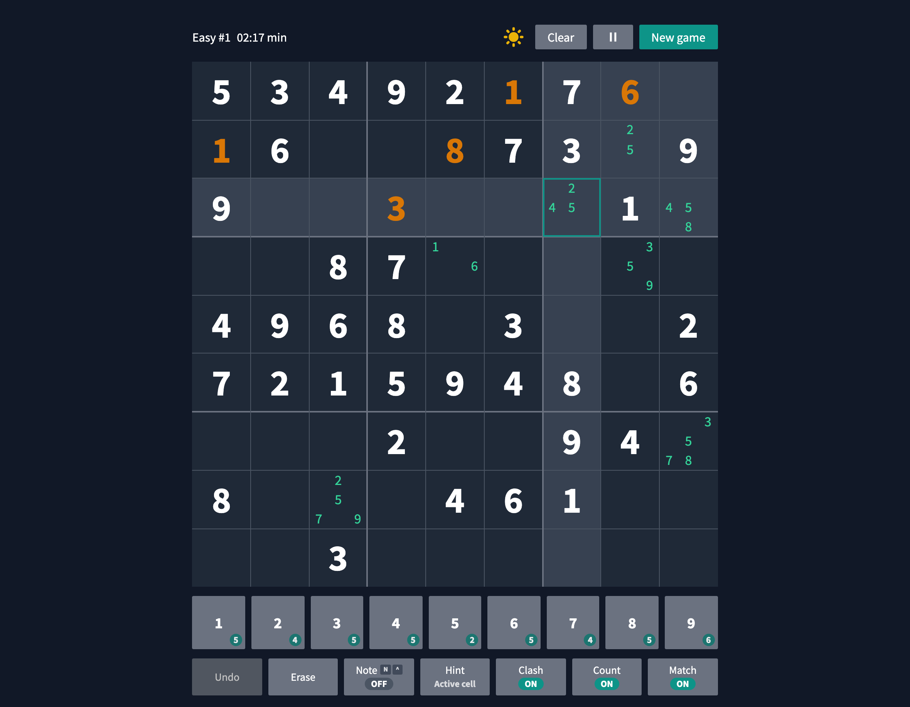
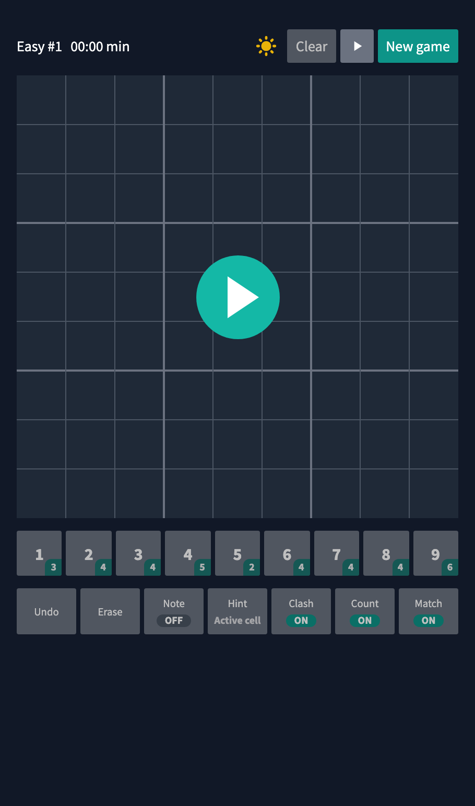

# Sudoku

[](https://github.com/slpixe/sudoku/actions/workflows/run_tests.yaml)
[](LICENSE)
[](https://nodejs.org/)

A fast, offline-ready Sudoku game with thousands of puzzles, touch-friendly controls, keyboard shortcuts, and local progress saving.

**Play it:** [sudoku.slpixe.com](https://sudoku.slpixe.com)



<p align="center">
  
</p>

## Highlights

- More than 3,000 puzzles across five difficulty levels
- Full notes workflow with automatic notes, custom notes, and conflict highlighting
- Undo and redo, hints, completion statistics, and per-puzzle progress
- Installable PWA with offline play and update handling
- Responsive layouts and polished touch controls for phones and tablets
- Keyboard and number-pad navigation, including held-key note entry
- Light and dark themes with accessible controls
- Internationalized interface with automatic browser-language selection
- Custom puzzle creation with validation and solving support

## Technical overview

The application is built with React, TypeScript, Vite, and Tailwind CSS. Game progress and preferences are persisted locally, while routing supports compact, shareable puzzle URLs. The test suite combines Vitest unit coverage with Playwright end-to-end checks across light and dark themes, responsive viewports, persistence, gameplay, and PWA behavior.

Recent modernization work includes:

- pnpm-based local, CI, Docker, and Playwright workflows
- separated persistence, routing, and active-game ownership boundaries
- optimized rendering and code-split application bundles
- robust multi-tab game locking and recovery
- expanded accessibility, touch, keyboard, and offline coverage

## Development

### Requirements

- Node.js 24 or newer
- Corepack with the package-manager version pinned in `package.json`

```bash
git clone https://github.com/slpixe/sudoku.git
cd sudoku
corepack enable
pnpm install --frozen-lockfile
pnpm start
```

The development server listens on [http://127.0.0.1:3000](http://127.0.0.1:3000) and is available to other devices on the local network.

### Verification

```bash
pnpm run typecheck
pnpm run lint
pnpm test
pnpm build
pnpm run test:e2e
```

### Docker

Build and run an optional self-hosted container locally:

```bash
docker build -t sudoku:latest .
docker run --rm -p 8081:80 sudoku:latest
```

## Project history

Sudoku was originally created by [Tom Nick](https://github.com/TN1ck). This version is substantially modernized and maintained by [Dean Quinney](https://github.com/slpixe), with a focus on architecture, reliability, accessibility, touch interaction, PWA behavior, and automated testing.

The imported upstream baseline remains covered by its original MIT copyright notice. Dean's subsequent modifications are also released under the MIT License.

## License

Licensed under the [MIT License](LICENSE).

Found a problem or have an idea? [Open an issue](https://github.com/slpixe/sudoku/issues).
